# MSE Radar - Target System Architecture (Arc42)

**Version:** 1.0  
**Date:** 2025-12-26  
**Status:** Target Architecture

---

## Table of Contents

1. [Introduction and Goals](#1-introduction-and-goals)
2. [Constraints](#2-constraints)
3. [Context and Scope](#3-context-and-scope)
4. [Solution Strategy](#4-solution-strategy)
5. [Building Block View](#5-building-block-view)
6. [Runtime View](#6-runtime-view)
7. [Deployment View](#7-deployment-view)
8. [Crosscutting Concepts](#8-crosscutting-concepts)
9. [Architecture Decisions](#9-architecture-decisions)
10. [Quality Requirements](#10-quality-requirements)
11. [Risks and Technical Debt](#11-risks-and-technical-debt)
12. [Glossary](#12-glossary)

---

## 1. Introduction and Goals

### 1.1 Purpose

MSE Radar is a team capability assessment application that helps software development teams measure and improve their software engineering skills through structured surveys based on DORA (DevOps Research and Assessment) capabilities.

### 1.2 Vision Statement

> Software development teams will gradually improve their software engineering skills. With the help of this tool, teams will be able to measure their current progress. It will point out areas where they need to focus their efforts and give tailored guidance on how to improve their skills.

### 1.3 Key Goals

| Goal                        | Description                                                          |
|:----------------------------|:---------------------------------------------------------------------|
| Enable Self-Assessment      | Allow teams to assess their capabilities using DORA-based surveys    |
| Track Progress Over Time    | Support repeated assessments to visualize improvement trends         |
| Provide Actionable Guidance | Deliver tailored recommendations based on assessed capability levels |
| Ensure Privacy              | Protect individual responses while enabling team-level insights      |

### 1.4 Key Quality Goals

| Quality Goal              | Description                                                                  |
|:--------------------------|:-----------------------------------------------------------------------------|
| Privacy & Confidentiality | Individual responses remain private; only aggregated results visible to team |
| Usability                 | Intuitive interface for survey participation and results visualization       |
| Reliability               | Survey data is never lost; results are consistently computed                 |
| Evolvability              | System can adapt to changes in DORA capabilities and survey questions        |

### 1.5 Stakeholders

| Stakeholder      | Role                  | Concerns                                                   |
|:-----------------|:----------------------|:-----------------------------------------------------------|
| Team Members     | Survey respondents    | Easy survey completion, private responses, clear results   |
| Team Leads       | Survey administrators | Manage teams, initiate surveys, facilitate discussions     |
| Development Team | System builders       | Maintainable code, clear architecture, testable components |

---

## 2. Constraints

### 2.1 Technical Constraints

| ID   | Constraint          | Rationale                                                                                       |
|:-----|:--------------------|:------------------------------------------------------------------------------------------------|
| TC-1 | Astro Web Framework | Project uses Astro for server-first, content-driven architecture with islands for interactivity |
| TC-2 | SQLite Database     | Lightweight relational database for structured data with ACID compliance; file-based storage    |
| TC-3 | TypeScript          | Type safety across frontend and backend code                                                    |
| TC-4 | Deno Runtime        | Used for scripts and acceptance tests                                                           |
| TC-5 | BDD/TDD Practices   | Acceptance Test Driven Development ensures requirements are met                                 |

### 2.2 Organizational Constraints

| ID   | Constraint                              | Rationale                                                        |
|:-----|:----------------------------------------|:-----------------------------------------------------------------|
| OC-1 | Email/Password Authentication Initially | SSO/enterprise authentication is a "Could Have" requirement      |
| OC-2 | Two Role Types Only                     | Team Lead and Team Member; no fine-grained permissions initially |
| OC-3 | DORA Capabilities as Foundation         | Survey content based on established DORA research                |

### 2.3 Conventions

| ID   | Convention                    | Rationale                                                 |
|:-----|:------------------------------|:----------------------------------------------------------|
| CV-1 | Likert Scale (1-5)            | Standardized response format for all capability questions |
| CV-2 | One Capability = One Question | Simplifies survey model and scoring                       |
| CV-3 | Last-Write-Wins               | Multiple submissions allowed; latest overrides previous   |

---

## 3. Context and Scope

### 3.1 Business Context

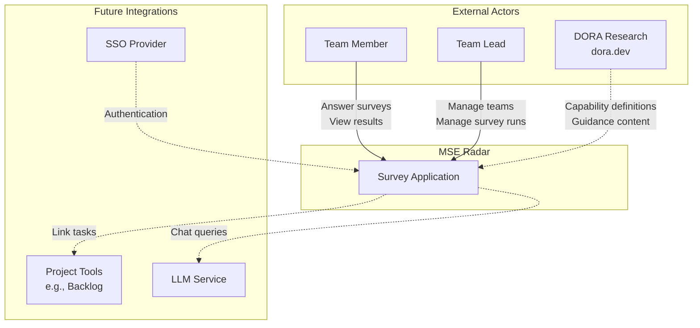

### 3.2 External Actors and Systems

| Actor/System             | Type               | Interaction                                               |
|:-------------------------|:-------------------|:----------------------------------------------------------|
| Team Member              | Human              | Registers, answers surveys, views team results            |
| Team Lead                | Human              | All Team Member actions + manages team and survey runs    |
| DORA Research (dora.dev) | External Reference | Source of capability definitions and improvement guidance |
| SSO Provider (Future)    | External System    | Google, Microsoft, or SAML/OIDC authentication            |
| Project Tools (Future)   | External System    | Backlog systems for linking improvement tasks             |
| LLM Service (Future)     | External System    | Chat assistant for capability questions                   |

### 3.3 Technical Context

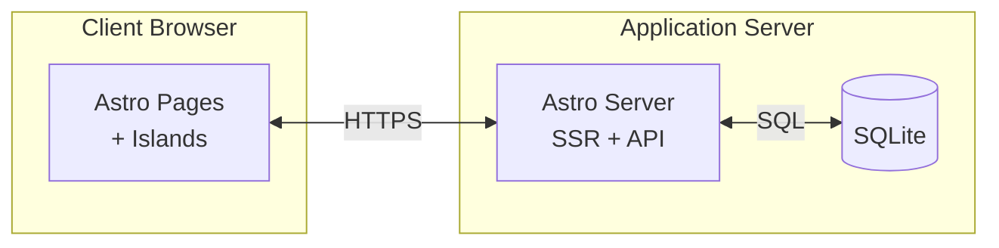

---

## 4. Solution Strategy

### 4.1 Technology Decisions

| Decision      | Technology | Rationale                                                                                                         |
|:--------------|:-----------|:------------------------------------------------------------------------------------------------------------------|
| Web Framework | Astro      | Server-first architecture ideal for content-driven survey application; islands provide interactivity where needed |
| Database      | SQLite     | Lightweight embedded database with ACID compliance; simple deployment with file-based storage                     |
| Language      | TypeScript | Type safety reduces bugs; consistent across frontend and backend                                                  |
| Testing       | Deno       | BDD acceptance tests ensure requirements are met; component and unit tests verify implementation                  |

### 4.2 Architectural Approach

**Server-First with Islands Architecture**

The application follows Astro's philosophy:
- **Static HTML by default**: Most pages render server-side for fast initial loads
- **Interactive Islands**: JavaScript hydration only for components requiring interactivity (e.g., survey form, charts)
- **API Routes**: Server-side API endpoints for data mutations and complex queries

**Domain-Driven Design**

The system is organized around six bounded contexts that map to logical modules:
- Core Domains receive primary development focus
- Supporting and Generic domains use simpler implementations or existing solutions

### 4.3 Key Design Principles

1. **Privacy by Design**: Individual responses protected at architectural level
2. **Evolvability**: Survey model versioning supports question changes without breaking history
3. **Simplicity**: Two-role model initially; extensible for future needs
4. **Testability**: BDD/TDD practices with acceptance tests driving development

---

## 5. Building Block View

### 5.1 Level 1: System Context

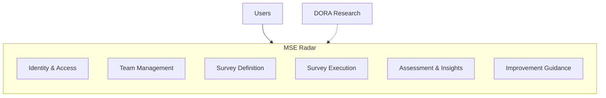

### 5.2 Level 2: Bounded Context Decomposition

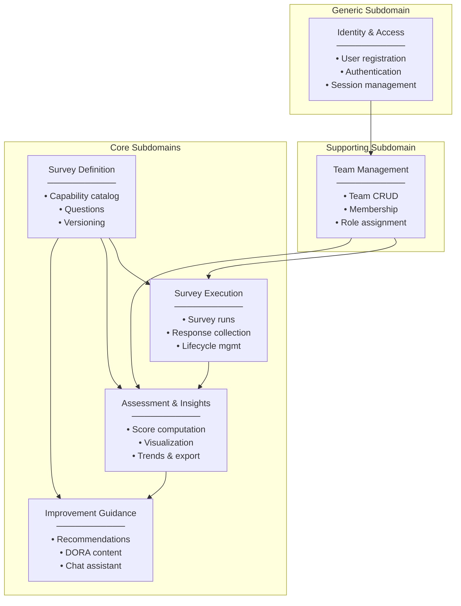

### 5.3 Module Structure

| Module      | Bounded Context       | Type       | Key Components                                                 |
|:------------|:----------------------|:-----------|:---------------------------------------------------------------|
| `auth`      | Identity & Access     | Generic    | UserService, SessionManager, AuthMiddleware                    |
| `teams`     | Team Management       | Supporting | TeamService, MembershipRepository, RoleManager                 |
| `surveys`   | Survey Definition     | Core       | DoraCapabilityCatalog, QuestionRepository, VersionManager      |
| `execution` | Survey Execution      | Core       | SurveyRunService, ResponseCollector, LifecycleManager          |
| `insights`  | Assessment & Insights | Core       | ScoreCalculator, TrendAnalyzer, ExportService, ChartComponents |
| `guidance`  | Improvement Guidance  | Core       | GuidanceRepository, RecommendationEngine, ChatAssistant        |

### 5.4 Database Schema Overview

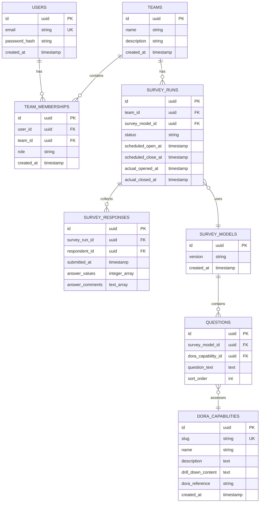

---

## 6. Runtime View

### 6.1 Scenario: User Registration and Team Creation

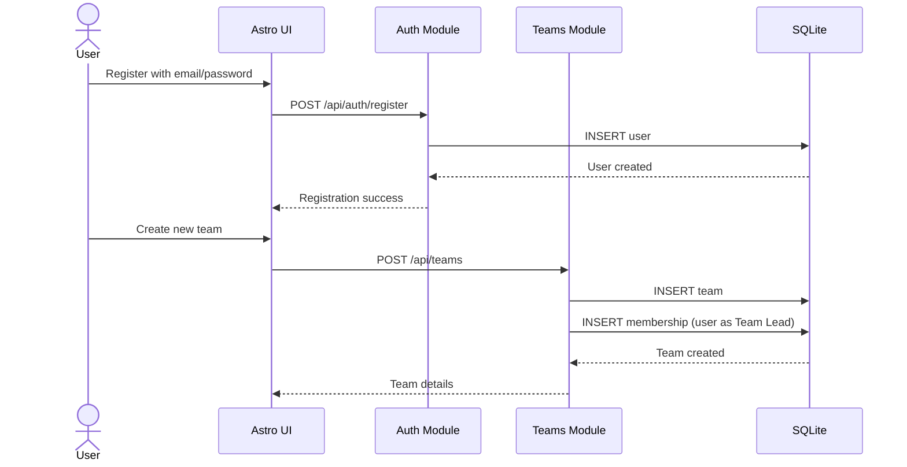

### 6.2 Scenario: Survey Run Lifecycle

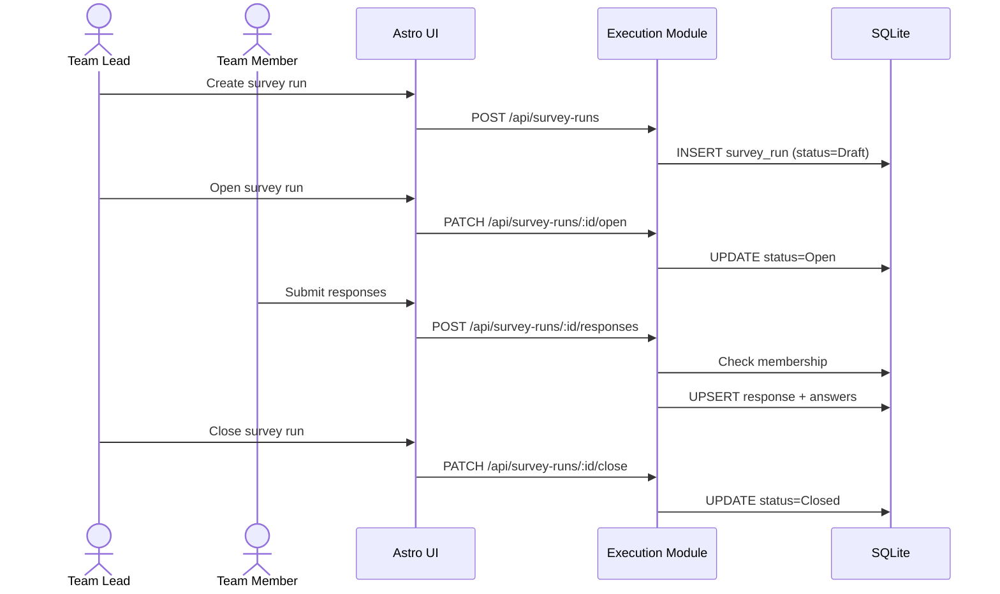

### 6.3 Scenario: View Results and Guidance

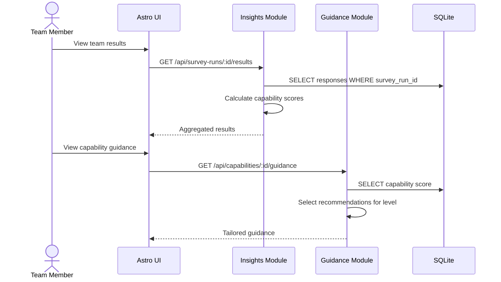

### 6.4 Scenario: Response Privacy Enforcement

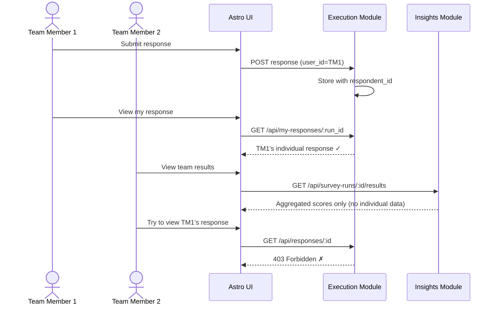

---

## 7. Deployment View

### 7.1 Infrastructure Overview

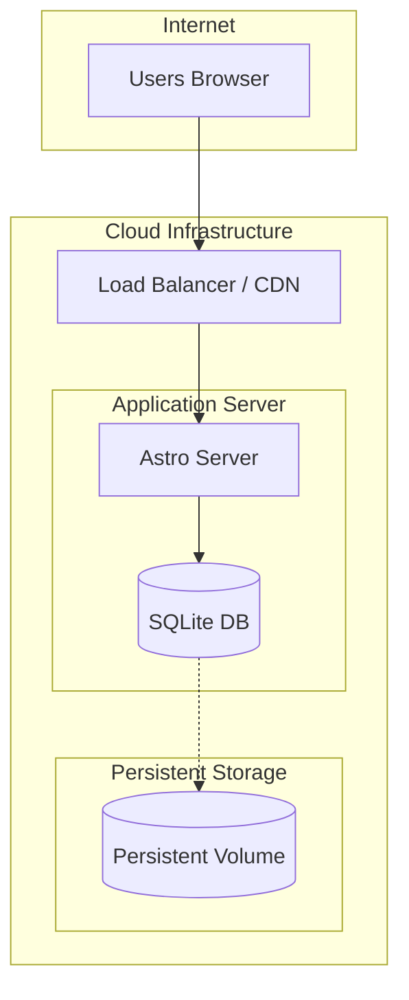

**SQLite Deployment Considerations:**

SQLite is an embedded, file-based database. The architecture above reflects a **single-instance deployment**, which is the recommended approach for SQLite.

| Scenario                                   | Recommendation                                                                                |
|:-------------------------------------------|:----------------------------------------------------------------------------------------------|
| **Small teams (< 50 concurrent users)**    | Single instance with SQLite works well                                                        |
| **Medium traffic**                         | Single instance with SQLite + WAL mode handles concurrent reads efficiently                   |
| **High availability / horizontal scaling** | Consider migrating to PostgreSQL or using SQLite replication tools (e.g., LiteFS, Litestream) |

**Why not multiple instances with SQLite?**
- SQLite uses file-level locking; multiple servers cannot safely write to the same database file over a network
- Each server having its own SQLite file would result in data inconsistency
- For multi-instance deployments, a client-server database (PostgreSQL, MySQL) is more appropriate

### 7.2 Deployment Environments

| Environment | Purpose                   | Infrastructure                                              |
|:------------|:--------------------------|:------------------------------------------------------------|
| Development | Local development         | Astro dev server + SQLite file (no external dependencies)   |
| Testing     | Automated tests           | Isolated SQLite database files per test run                 |
| Staging     | Pre-production validation | Cloud-hosted, mirrors production                            |
| Production  | Live system               | Cloud-hosted with persistent storage for SQLite database    |

### 7.3 Component Deployment

| Component       | Technology               | Deployment Target                      |
|:----------------|:-------------------------|:---------------------------------------|
| Web Application | Astro (Node.js adapter)  | Container / Cloud Platform             |
| Database        | SQLite (embedded)        | Local file on persistent storage       |
| Static Assets   | Images, CSS, JS          | CDN                                    |
| Secrets         | API keys, credentials    | Environment Variables / Secret Manager |

### 7.4 Assumptions

- Cloud deployment on a platform supporting Node.js (e.g., AWS, GCP, Azure, Vercel, Railway)
- Persistent storage for SQLite database file (e.g., EBS volume, persistent disk)
- HTTPS termination at load balancer/CDN level
- Single-instance deployment recommended; for multi-instance, use shared storage or consider database migration

---

## 8. Crosscutting Concepts

### 8.1 Security

#### 8.1.1 Authentication

- **Initial Release**: Email/password authentication with secure password hashing (bcrypt/argon2)
- **Session Management**: HTTP-only secure cookies with session tokens
- **Future**: SSO integration via OAuth 2.0 / OIDC (Google, Microsoft, SAML)

#### 8.1.2 Authorization

| Resource           | Team Lead     | Team Member   |
|:-------------------|:--------------|:--------------|
| Team details       | Read/Write    | Read          |
| Team membership    | Manage        | View          |
| Survey runs        | Create/Manage | View          |
| Own responses      | Submit/Edit   | Submit/Edit   |
| Others' responses  | No access     | No access     |
| Aggregated results | View (closed) | View (closed) |
| Guidance           | View          | View          |

#### 8.1.3 Data Protection

- **Response Privacy**: Individual responses stored with protected respondent identifiers
- **Aggregation Boundary**: Results API only returns aggregated scores, never individual responses
- **Audit Trail**: Sensitive operations logged with timestamp and actor (protected)

### 8.2 Persistence

#### 8.2.1 Database Strategy

- **SQLite** as primary data store for all application data (embedded, file-based)
- **WAL Mode**: Write-Ahead Logging enabled for better concurrent read performance
- **Repository Pattern**: Data access encapsulated in repository classes per aggregate
- **Transactions**: Multi-table operations wrapped in database transactions

#### 8.2.2 Data Integrity

- Foreign key constraints enforce referential integrity
- Check constraints validate business rules at database level
- Unique constraints prevent duplicate emails, overlapping survey runs

### 8.3 Error Handling

#### 8.3.1 Error Categories

| Category                | HTTP Status | Handling                            |
|:------------------------|:------------|:------------------------------------|
| Validation Error        | 400         | Return field-level errors to client |
| Authentication Error    | 401         | Redirect to login                   |
| Authorization Error     | 403         | Display "access denied" message     |
| Not Found               | 404         | Display friendly "not found" page   |
| Business Rule Violation | 409/422     | Display specific error message      |
| Server Error            | 500         | Log error, display generic message  |

#### 8.3.2 Error Response Format

```json
{
  "error": {
    "code": "SURVEY_RUN_NOT_OPEN",
    "message": "Cannot submit response: survey run is not open",
    "details": {
      "surveyRunId": "...",
      "currentStatus": "Closed"
    }
  }
}
```

### 8.4 Logging and Observability

#### 8.4.1 Logging Strategy

| Log Level | Usage                                              |
|:----------|:---------------------------------------------------|
| ERROR     | Unexpected failures, exceptions                    |
| WARN      | Business rule violations, deprecated usage         |
| INFO      | Key operations (survey opened, response submitted) |
| DEBUG     | Detailed flow information (development only)       |

#### 8.4.2 Key Metrics

- Survey response submission rate
- Survey run completion rate
- Response time percentiles (p50, p95, p99)
- Error rates by endpoint

### 8.5 Internationalization (i18n)

- UI text externalized for translation
- Astro's built-in i18n routing support
- Guidance content managed separately per locale
- Initial release: English only; architecture supports multi-language

### 8.6 Testing Strategy

#### 8.6.1 Test Approach

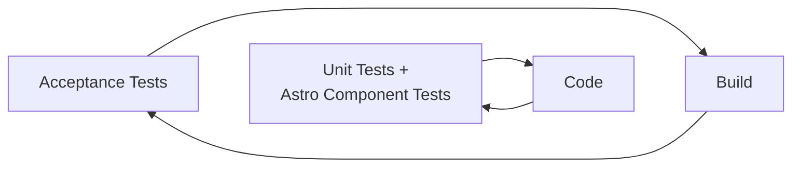
- **Acceptance Tests:** BDD scenarios; Deno-based
- **Unit Tests:** Pure unit tests for business logic and utilities
- **Component Tests:** Astro UI component tests

#### 8.6.2 Four Layer Model for Acceptance Tests

The project uses the **Four Layer Model** as taught by Dave Farley in *Modern Software Engineering* and *Continuous Delivery*. This architecture creates a clear separation of concerns in acceptance tests, making them more maintainable, readable, and resilient to change.

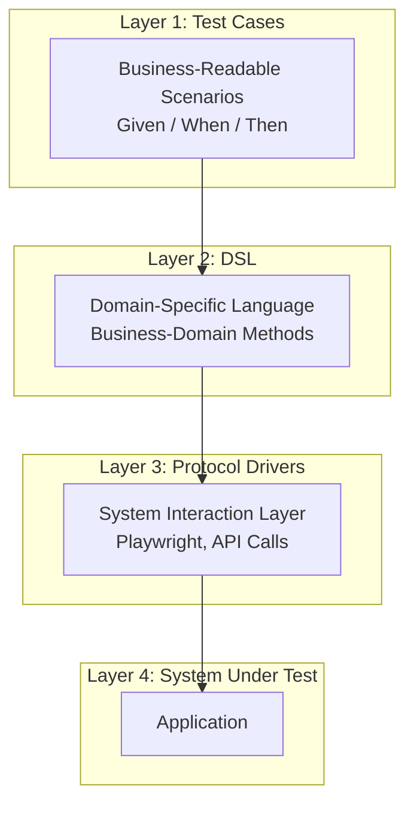

**Layer Descriptions:**

| Layer                              | Purpose                                                                                                                                                                                                 |
|:-----------------------------------|:--------------------------------------------------------------------------------------------------------------------------------------------------------------------------------------------------------|
| **Test Cases**                     | Express business scenarios in natural language using Given/When/Then format. Should be readable by non-technical stakeholders.                                                                          |
| **DSL (Domain-Specific Language)** | Translate business concepts into reusable methods. Encapsulates what the system should do without specifying how. Uses ubiquitous language from the domain.                                             |
| **Protocol Drivers**               | Translators (adapters) that convert DSL calls into the "language of the system". This isolation means changes to the system's interface only require updates to the drivers, not the DSL or test cases. |
| **System Under Test**              | The actual application being tested. Tests interact with it only through protocol drivers.                                                                                                              |

**Benefits of this approach:**

1. **Separation of Concerns**: Each layer has a single responsibility
2. **Maintainability**: Changes to the system's API only affect protocol drivers, not test cases
3. **Readability**: Test cases remain business-focused and understandable
4. **Reusability**: DSL methods can be composed to create new test scenarios
5. **Flexibility**: Protocol drivers can be swapped (e.g., from HTTP to in-memory) without changing tests

**Project Implementation:**

```
acceptance/
├── tests/                    # Layer 1: Test Cases (Given/When/Then scenarios)
│   ├── user_registration/
│   ├── team_management/
│   └── survey_execution/
├── dsl/                      # Layer 2: Domain-Specific Language
│   ├── user_dsl.ts
│   ├── team_dsl.ts
│   └── survey_dsl.ts
└── drivers/                  # Layer 3: Protocol Drivers
    ├── http_driver.ts
    └── database_driver.ts
```

**Example Test Structure:**

```typescript
// Layer 1: Test Case
Deno.test("User can create a team after registration", async () => {
  // Given
  const user = await givenARegisteredUser("alice@example.com");
  
  // When
  const team = await whenUserCreatesTeam(user, "Engineering Team");
  
  // Then
  await thenTeamShouldExist(team.id);
  await thenUserShouldBeTeamLead(user, team);
});

// Layer 2: DSL (in dsl/user_dsl.ts)
export async function givenARegisteredUser(email: string): Promise<User> {
  return await userDriver.register({ email, password: "test-password" });
}

// Layer 3: Protocol Driver (in drivers/http_driver.ts)
export const userDriver = {
  async register(credentials: Credentials): Promise<User> {
    const response = await fetch(`${BASE_URL}/api/auth/register`, {
      method: "POST",
      body: JSON.stringify(credentials),
    });
    return response.json();
  }
};
```

#### 8.6.3 Test Commands

- `deno task test:acceptance` - BDD acceptance tests
- `deno task test:unit` - Unit tests
- `deno task test:astro:unit` - Astro component tests

---

## 9. Architecture Decisions

### ADR-001: Astro as Web Framework

**Status:** Accepted

**Context:**  
The application needs a web framework that supports server-side rendering for security (keeping data logic server-side) while providing modern developer experience and selective client-side interactivity for survey forms and charts.

**Decision:**  
Use Astro web framework with its islands architecture.

**Consequences:**
- (+) Server-first approach keeps sensitive data handling on server
- (+) Minimal JavaScript shipped to client by default
- (+) Islands allow targeted interactivity (survey forms, charts)
- (+) TypeScript support out of the box
- (-) Team needs to learn Astro-specific patterns
- (-) Some interactive features require explicit island setup

---

### ADR-002: SQLite as Primary Database

**Status:** Accepted (Updated)

**Context:**  
Survey data has clear relational structure (users, teams, surveys, responses). Data integrity is critical—responses must not be lost or corrupted. The application is expected to have moderate traffic with small to medium team sizes. Simplicity of deployment and zero external dependencies are valued.

**Decision:**  
Use SQLite as the single primary database with WAL (Write-Ahead Logging) mode enabled.

**Consequences:**
- (+) ACID compliance ensures data integrity
- (+) Zero configuration—no separate database server required
- (+) Simple deployment—single file database, easy backups
- (+) No external dependencies—reduces operational complexity
- (+) Fast for read-heavy workloads typical of survey applications
- (+) Excellent for development and testing (isolated DB files per test)
- (-) Limited concurrent write throughput (database-level locking)
- (-) Not suitable for horizontal scaling across multiple servers without shared storage
- (-) Less tooling compared to PostgreSQL ecosystem

**Migration Note:** Originally PostgreSQL was chosen, but switched to SQLite to simplify deployment and reduce infrastructure requirements. Arrays are stored as JSON text.

---

### ADR-003: Bounded Contexts as Module Boundaries

**Status:** Accepted

**Context:**  
The domain analysis identified six bounded contexts. The codebase needs clear organization that supports independent evolution and team ownership.

**Decision:**  
Map bounded contexts to top-level modules in the codebase. Each module owns its entities, repositories, and services.

**Consequences:**
- (+) Clear ownership and responsibility boundaries
- (+) Modules can evolve independently
- (+) Enables future extraction to services if needed
- (-) Cross-context queries require coordination
- (-) Some duplication of common patterns across modules

---

### ADR-004: Response Privacy via Aggregation Boundary

**Status:** Accepted

**Context:**  
Individual responses must remain private (pseudonymous), but team results need to show aggregated scores. The system must prevent accidental or intentional exposure of individual responses.

**Decision:**  
Enforce privacy at the architectural level:
1. Response storage includes respondent_id (for uniqueness enforcement)
2. Results API only returns computed aggregates, never individual responses
3. Only the response submitter can access their own responses
4. Audit identifiers are protected and not exposed in APIs

**Consequences:**
- (+) Privacy enforced by architecture, not just policy
- (+) Clear separation between response collection and results viewing
- (+) Supports audit requirements while maintaining pseudonymity
- (-) Cannot implement features showing individual-level data
- (-) Requires careful API design to prevent data leakage

---

### ADR-005: Survey Model Versioning for Evolvability

**Status:** Accepted

**Context:**  
DORA capabilities may evolve over time. Survey questions may need updates. Historical survey runs must remain interpretable with their original questions.

**Decision:**  
Implement survey model versioning:
1. Each survey model has a version identifier
2. Survey runs reference a specific model version
3. Changes to questions create new versions
4. Historical runs retain their original version reference

**Consequences:**
- (+) Historical data remains interpretable
- (+) Supports gradual evolution of survey content
- (+) Enables comparison logic (same version vs. different versions)
- (-) Adds complexity to survey definition management
- (-) Trend analysis across versions requires careful handling

---

### ADR-006: BDD/TDD with Acceptance Tests

**Status:** Accepted

**Context:**  
Requirements are documented as user stories with clear acceptance criteria. Development should verify requirements are met, not just that code works technically.

**Decision:**  
Use Acceptance Test Driven Development (ATDD) with BDD-style tests:
1. Acceptance tests written in Given/When/Then format
2. Tests located in `acceptance/` directory
3. Run via Deno test runner
4. Tests drive development of features

**Consequences:**
- (+) Requirements directly verified by automated tests
- (+) Living documentation of system behavior
- (+) Catches requirement misunderstandings early
- (-) Higher initial investment in test infrastructure
- (-) Tests must be maintained alongside code

---

### ADR-007: No End-to-End Testing

**Status:** Accepted

**Context:**  
End-to-end (E2E) tests using browser automation (e.g., Playwright) provide high confidence but come with significant costs: slow execution, flakiness, complex setup, and high maintenance burden. The project already employs a comprehensive testing strategy with acceptance tests (BDD), unit tests, and component tests.

**Decision:**  
Do not implement E2E browser-based tests. Instead, rely on:
1. Acceptance tests for verifying business requirements
2. Component tests for Astro UI components
3. Unit tests for business logic and utilities

**Consequences:**
- (+) Faster test execution and CI/CD pipelines
- (+) Reduced test maintenance burden
- (+) No flaky tests from browser automation issues
- (+) Simpler testing infrastructure
- (-) Less confidence in full browser integration
- (-) Browser-specific bugs may not be caught automatically
- (-) Manual testing needed for critical user journeys

---

## 10. Quality Requirements

### 10.1 Quality Tree

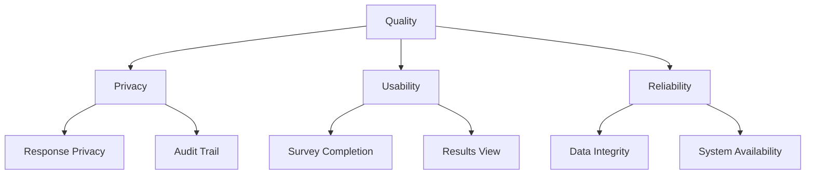

### 10.2 Quality Scenarios

#### QS-1: Response Privacy

| Attribute         | Value                                                             |
|:------------------|:------------------------------------------------------------------|
| Quality Goal      | Privacy                                                           |
| Scenario          | A team member tries to view another member's individual responses |
| Expected Response | System returns 403 Forbidden; no individual response data exposed |
| Priority          | Critical                                                          |

#### QS-2: Survey Completion

| Attribute         | Value                                                               |
|:------------------|:--------------------------------------------------------------------|
| Quality Goal      | Usability                                                           |
| Scenario          | Team member completes full survey (27 DORA capabilities)            |
| Expected Response | Survey completed in under 15 minutes with clear progress indication |
| Priority          | High                                                                |

#### QS-3: Results Visualization

| Attribute         | Value                                                       |
|:------------------|:------------------------------------------------------------|
| Quality Goal      | Usability                                                   |
| Scenario          | Team member views capability profile after survey closes    |
| Expected Response | Results displayed within 2 seconds with clear visualization |
| Priority          | High                                                        |

#### QS-4: Data Integrity

| Attribute         | Value                                                                                   |
|:------------------|:----------------------------------------------------------------------------------------|
| Quality Goal      | Reliability                                                                             |
| Scenario          | User submits response during database connection issue                                  |
| Expected Response | Response is either fully saved or user is clearly notified of failure; no partial saves |
| Priority          | Critical                                                                                |

#### QS-5: System Availability

| Attribute         | Value                                                 |
|:------------------|:------------------------------------------------------|
| Quality Goal      | Reliability                                           |
| Scenario          | Team needs to complete survey during business hours   |
| Expected Response | System available 99.5% during business hours (target) |
| Priority          | Medium                                                |

#### QS-6: Trend Analysis Performance

| Attribute         | Value                                                    |
|:------------------|:---------------------------------------------------------|
| Quality Goal      | Usability                                                |
| Scenario          | Team member views trend across 10 historical survey runs |
| Expected Response | Trend visualization loads within 3 seconds               |
| Priority          | Medium                                                   |

#### QS-7: Survey Model Evolution

| Attribute         | Value                                                        |
|:------------------|:-------------------------------------------------------------|
| Quality Goal      | Evolvability                                                 |
| Scenario          | Product team adds new DORA capability to survey model        |
| Expected Response | New version created without affecting historical survey runs |
| Priority          | High                                                         |

---

## 11. Risks and Technical Debt

### 11.1 Identified Risks

#### R-1: Scoring Method Undefined

| Attribute   | Value                                                                             |
|:------------|:----------------------------------------------------------------------------------|
| Risk        | Scoring algorithm for capability scores not yet defined                           |
| Probability | Medium                                                                            |
| Impact      | High                                                                              |
| Mitigation  | Define scoring method (simple average initially); design for pluggable algorithms |
| Contingency | Use simple arithmetic mean as fallback                                            |

#### R-2: Cross-Version Comparability

| Attribute   | Value                                                                                |
|:------------|:-------------------------------------------------------------------------------------|
| Risk        | Comparing results across different survey model versions may be misleading           |
| Probability | Medium                                                                               |
| Impact      | Medium                                                                               |
| Mitigation  | Clearly indicate version differences in trend views; document comparison limitations |
| Contingency | Restrict trend analysis to same-version runs only                                    |

#### R-3: Pseudonymity Implementation Complexity

| Attribute   | Value                                                                             |
|:------------|:----------------------------------------------------------------------------------|
| Risk        | Balancing response uniqueness enforcement with privacy is technically challenging |
| Probability | Low                                                                               |
| Impact      | High                                                                              |
| Mitigation  | Use hash-based identifiers; careful API design; security review                   |
| Contingency | Accept slightly weaker privacy guarantees with clear documentation                |

#### R-4: LLM Integration Uncertainty

| Attribute   | Value                                                                                    |
|:------------|:-----------------------------------------------------------------------------------------|
| Risk        | Chat assistant (LLM integration) requirements unclear; API costs and reliability unknown |
| Probability | High                                                                                     |
| Impact      | Low (feature is "Could Have")                                                            |
| Mitigation  | Design modular integration point; defer implementation until requirements clear          |
| Contingency | Implement static FAQ instead of LLM chat                                                 |

#### R-5: DORA Content Licensing/Updates

| Attribute   | Value                                                                           |
|:------------|:--------------------------------------------------------------------------------|
| Risk        | DORA capability definitions may change; unclear licensing for content usage     |
| Probability | Low                                                                             |
| Impact      | Medium                                                                          |
| Mitigation  | Anti-corruption layer for DORA content; track source versions; verify licensing |
| Contingency | Create original content inspired by DORA concepts                               |

### 11.2 Technical Debt Considerations

| Item | Description                                  | Priority to Address               |
|:-----|:---------------------------------------------|:----------------------------------|
| TD-1 | Overall summary calculation method undefined | Before results feature completion |
| TD-2 | Data retention policy not implemented        | Before production launch          |
| TD-3 | Notification system not architected          | Before scheduling feature         |
| TD-4 | Export format specifications incomplete      | Before export feature             |

---

## 12. Glossary

This glossary incorporates the ubiquitous language from the domain model.

| Term                        | Definition                                                                                                           |
|:----------------------------|:---------------------------------------------------------------------------------------------------------------------|
| **Account**                 | A user's registration record including email and authentication credentials                                          |
| **Aggregated Results**      | Team-level computed scores and summaries shown after a survey run is closed; never includes raw individual responses |
| **Answer**                  | A single response value (numeric + optional comment) for one capability question                                     |
| **Assessment**              | The process of evaluating a team's capabilities through a survey run                                                 |
| **Audit Context**           | Metadata stored with responses: timestamp, survey run ID, respondent ID (protected)                                  |
| **Authentication**          | Verifying a user's identity through credentials (email/password or SSO provider)                                     |
| **Authorization**           | Granting a user access to a specific team with a specific role                                                       |
| **Capability**              | A DORA-defined engineering capability assessed by one survey question                                                |
| **Capability Drill-down**   | Detailed explanation of what a capability measures and why it matters                                                |
| **Capability Profile**      | The complete set of capability scores for a team from one survey run                                                 |
| **Capability Score**        | A numeric value (computed from responses) representing the team's assessed level for one capability                  |
| **Closed**                  | Survey run state when no more responses are accepted; results can be viewed                                          |
| **Confidence Indicator**    | Measure of agreement/variance across responses for a capability                                                      |
| **Disagreement**            | High variance in responses indicating team misalignment on a capability                                              |
| **DORA**                    | DevOps Research and Assessment; source of the capability framework (dora.dev)                                        |
| **DORA Capabilities**       | The capability set defined by DORA that forms the basis of surveys and guidance                                      |
| **Guidance**                | Actionable improvement advice presented per capability, grounded in DORA research                                    |
| **Islands (Architecture)**  | Astro's approach where most HTML is static, with interactive JavaScript "islands" added only where needed            |
| **Last-Write-Wins**         | Policy where the most recent submission overrides earlier ones for the same person and survey run                    |
| **Likert Scale**            | The 5-point numeric scale (1-5) used for all survey questions                                                        |
| **Open**                    | Survey run state when responses are being accepted                                                                   |
| **Participation**           | Whether and how completely a team member has responded to a survey run                                               |
| **Pseudonymity**            | Individual identities hidden from other team members while enforcing one response per member                         |
| **Question**                | The prompt for assessing one capability in a survey                                                                  |
| **Question Versioning**     | Tracking changes to survey questions over time so older runs remain interpretable                                    |
| **Registration**            | Creating a new user account in the system                                                                            |
| **Response**                | A team member's submitted answers for a survey run; may include optional comments                                    |
| **Result**                  | See Aggregated Results                                                                                               |
| **Role**                    | A permission set assigned to a user in a team; either Team Lead or Team Member                                       |
| **Scheduled**               | Survey run state with planned future open/close times                                                                |
| **Session**                 | An authenticated user's active connection to the system                                                              |
| **Survey**                  | The questionnaire template used to assess a team's capabilities                                                      |
| **Survey Model**            | The complete structure and content of the survey (capabilities, questions, version)                                  |
| **Survey Run**              | A concrete execution instance of a survey for a specific team with its own timeframe and collected responses         |
| **Tailored Recommendation** | Guidance customized to the team's current assessed level on a capability                                             |
| **Team**                    | A group of people assessed together; survey runs, responses, and results are associated with a team                  |
| **Team Lead**               | A team member with additional permissions to manage the team, authorize members, and manage survey runs              |
| **Team Member**             | A user authorized for a team who can answer surveys and view their team's results                                    |
| **Trend View**              | Comparison of capability scores across multiple survey runs over time                                                |
| **User**                    | A registered individual with credentials to access the system                                                        |
| **Workshop View**           | Presentation-friendly view with discussion prompts for team sessions                                                 |

---

## Appendix A: Requirements Traceability

| Req ID | Requirement                     | Bounded Context       | ADR              |
|:-------|:--------------------------------|:----------------------|:-----------------|
| 0001   | Register user                   | Identity & Access     | ADR-001          |
| 0002   | Authenticate users              | Identity & Access     | ADR-001          |
| 0003   | Assign roles                    | Team Management       | ADR-003          |
| 0004   | Create and manage teams         | Team Management       | ADR-003          |
| 0005   | Authorize team members          | Team Management       | ADR-003          |
| 0006   | Role-based administration       | Team Management       | ADR-003          |
| 0007   | DORA capabilities-based survey  | Survey Definition     | ADR-005          |
| 0008   | Create survey run               | Survey Execution      | ADR-003          |
| 0009   | Open and close survey run       | Survey Execution      | ADR-003          |
| 0010   | Keep survey runs separate       | Survey Execution      | ADR-002, ADR-005 |
| 0011   | Answer a survey                 | Survey Execution      | ADR-004          |
| 0012   | Prevent responses outside state | Survey Execution      | ADR-003          |
| 0013   | Prevent non-member responses    | Survey Execution      | ADR-003          |
| 0014   | Store responses with audit      | Survey Execution      | ADR-002, ADR-004 |
| 0015   | Calculate capability scores     | Assessment & Insights | ADR-002          |
| 0016   | Visualize capability profile    | Assessment & Insights | ADR-001          |
| 0017   | Tailored improvement guidance   | Improvement Guidance  | ADR-003          |
| 0018   | Trend view                      | Assessment & Insights | ADR-005          |
| 0019   | Capability drill-down           | Survey Definition     | ADR-003          |
| 0020   | Schedule survey run             | Survey Execution      | ADR-003          |
| 0021   | Comments on answers             | Survey Execution      | ADR-002          |
| 0022   | Question versioning             | Survey Definition     | ADR-005          |
| 0023   | Pseudonymous responses          | Survey Execution      | ADR-004          |
| 0024   | Participation tracking          | Survey Execution      | ADR-003          |
| 0025   | Confidence indicators           | Assessment & Insights | ADR-003          |
| 0026   | Export results                  | Assessment & Insights | ADR-003          |
| 0027   | Workshop view                   | Assessment & Insights | ADR-001          |
| 0028   | Notifications                   | (Infrastructure)      | -                |
| 0029   | Customizable survey             | Survey Definition     | ADR-005          |
| 0030   | Next-best improvements          | Improvement Guidance  | ADR-003          |
| 0031   | LLM chat assistant              | Improvement Guidance  | -                |
| 0032   | Integration with tools          | (Infrastructure)      | -                |
| 0033   | Multi-language UI               | (Crosscutting)        | ADR-001          |
| 0034   | SSO authentication              | Identity & Access     | ADR-001          |

---

## Appendix B: Context Map (Detailed)

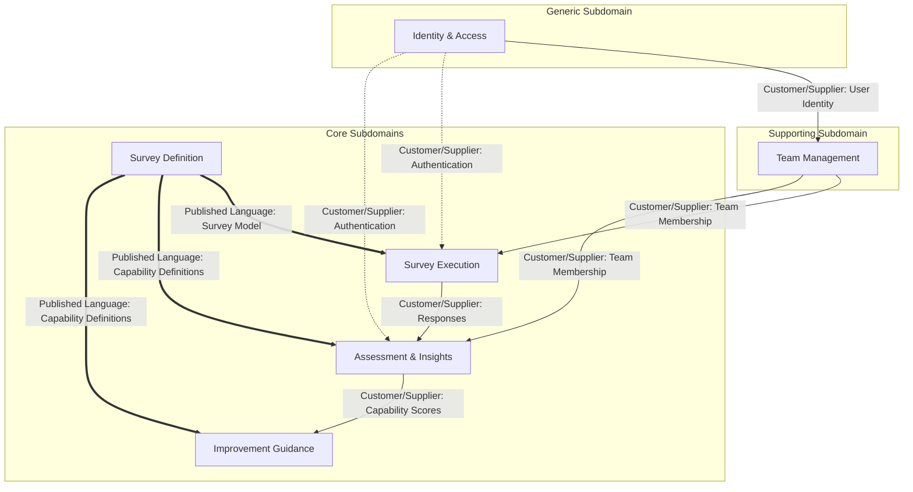

**Legend:**
- `→` Solid arrows: Customer/Supplier relationship
- `⇒` Double arrows: Published Language (shared model)
- `⇢` Dashed arrows: Indirect dependency
