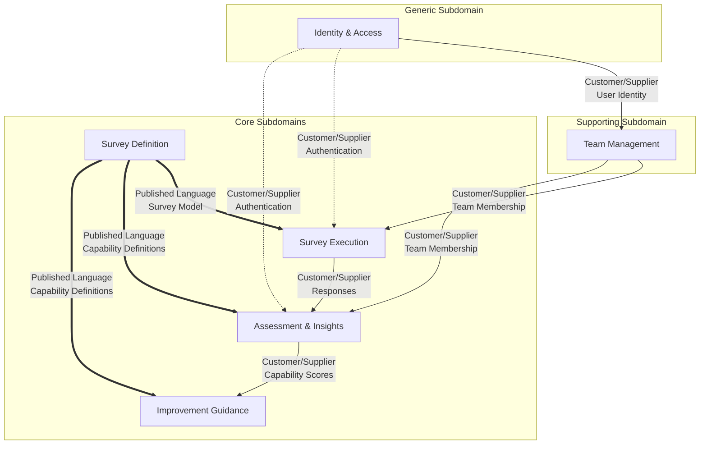

# Bounded Contexts & Ubiquitous Language

This document defines the Bounded Contexts and Ubiquitous Language for MSE Radar, a team capability assessment application based on DORA capabilities.

---

## Overview

MSE Radar helps software development teams measure and improve their software engineering skills through structured surveys based on DORA capabilities. The domain has been analyzed and divided into the following bounded contexts:

| Context               | Type       | Purpose                                                          |
|:----------------------|:-----------|:-----------------------------------------------------------------|
| Identity & Access     | Generic    | User identity, authentication, and system-level authorization    |
| Team Management       | Supporting | Team structure, membership, and role assignments                 |
| Survey Definition     | Core       | Survey model, capabilities, and question structure               |
| Survey Execution      | Core       | Running surveys, collecting responses, managing survey lifecycle |
| Assessment & Insights | Core       | Scoring, results analysis, visualization, and trends             |
| Improvement Guidance  | Core       | DORA-based recommendations and improvement advice                |

---

## 1. Identity & Access Context

### Core Responsibility and Purpose
Manages user identity, authentication, and global access control. This context is responsible for proving who a user is and maintaining their account across the system.

### Key Domain Concepts
- **User**: A person with an account in the system who can participate in teams
- **Account**: The registration and credentials for a user (email/password initially, SSO in future)
- **Authentication**: The process of proving a user's identity when signing in
- **Session**: An authenticated user's active connection to the system

### Boundaries

**Included:**
- User registration and account creation
- Sign-in/sign-out (authentication)
- Password management and credential storage
- SSO/enterprise authentication integration (future)
- Account lifecycle (deactivation, deletion)

**NOT Included:**
- Team-level permissions (handled by Team Management)
- What actions a user can perform within a team (authorization is context-specific)
- User preferences for specific features

### Relationships with Other Contexts
- **Downstream to Team Management**: Provides verified user identity; Team Management consumes user identity to assign team memberships
- **Downstream to all other contexts**: All contexts rely on authenticated user identity

### Ubiquitous Language

| Term           | Meaning in This Context                                                       |
|:---------------|:------------------------------------------------------------------------------|
| User           | A registered individual with credentials to access the system                 |
| Account        | The user's registration record including email and authentication credentials |
| Authentication | Verifying identity through credentials (email/password or SSO provider)       |
| Session        | The authenticated state between sign-in and sign-out                          |
| Registration   | Creating a new user account in the system                                     |

#### Key Entities
- **User** (Aggregate Root): id, email, passwordHash, createdAt

#### Value Objects
- **Email**: Validated email address format
- **Credentials**: Password or SSO token

#### Domain Events
- `UserRegistered`
- `UserAuthenticated`
- `UserSignedOut`
- `AccountDeactivated`

#### Business Rules/Invariants
- Email addresses must be unique across all users
- Users must authenticate before accessing protected features
- Password must meet minimum security requirements

---

## 2. Team Management Context

### Core Responsibility and Purpose
Manages team structure, membership, and role assignments. This context handles how users are organized into teams and what roles they hold within each team.

### Key Domain Concepts
- **Team**: A group of people assessed together; the organizational unit for survey runs and results
- **Team Member**: A user authorized for a team who can answer surveys and view results
- **Team Lead**: A team member with additional permissions to manage the team, authorize members, and manage survey runs
- **Role**: A permission set assigned to a user within a team
- **Authorization**: Granting a user access to a specific team and its survey runs/results

### Boundaries

**Included:**
- Creating and managing teams (name, description, creation date)
- Adding and removing team members
- Assigning and changing roles within a team
- Team-level authorization rules
- Managing team leads

**NOT Included:**
- User identity and authentication (Identity & Access context)
- Survey content and structure (Survey Definition context)
- Survey lifecycle management (Survey Execution context)
- Viewing or managing results (Assessment & Insights context)

### Relationships with Other Contexts
- **Upstream from Identity & Access**: Receives authenticated user identity
- **Downstream to Survey Execution**: Provides team membership information for response authorization
- **Downstream to Assessment & Insights**: Provides team membership for results visibility

### Ubiquitous Language

| Term          | Meaning in This Context                                                              |
|:--------------|:-------------------------------------------------------------------------------------|
| Team          | A named group with description by a user, containing members with roles              |
| Team Lead     | A role with permissions to manage team details, members, and initiate survey runs    |
| Team Member   | A role allowing participation in survey runs and viewing team results                |
| Authorization | The act of adding a user to a team with a specific role                              |
| Role          | Either "Team Lead" or "Team Member" (no fine-grained permissions in initial release) |
| Basic Details | Team name, description, creation date, team lead(s), and member list                 |

#### Key Entities
- **Team** (Aggregate Root): id, name, description, members[]
- **TeamMembership**: userId, teamId, role

#### Value Objects
- **Role**: Enum of TeamLead, TeamMember
- **TeamName**: Non-empty string with validation

#### Domain Events
- `TeamCreated`
- `MemberAdded`
- `MemberRemoved`
- `RoleChanged`
- `TeamDetailsUpdated`

#### Business Rules/Invariants
- Every team must have at least one Team Lead
- The user who creates a team becomes its first Team Lead
- A user can be a member of multiple teams with different roles in each
- Team Leads are also Team Members (they can answer surveys)
- Any authenticated user can create a team

---

## 3. Survey Definition Context

### Core Responsibility and Purpose
Defines the structure and content of surveys, including the DORA capabilities being assessed, questions, scales, and versioning. This is the "what" of the assessment model.

### Key Domain Concepts
- **Survey Model**: A versioned survey structure containing questions that assess DORA capabilities
- **DORA Capability**: An independent, externally defined engineering capability from dora.dev; serves as stable reference data
- **Question**: A survey item belonging to a survey model that assesses one DORA capability, using a Likert scale
- **Likert Scale**: The numeric answer format (1-7) for survey questions
- **Question Versioning**: Tracking changes to the survey question set over time; new questions reference the same stable capabilities

### Boundaries

**Included:**
- DORA capabilities catalog and definitions
- Survey question content and structure
- Likert scale definitions (1-7)
- Question versioning and evolution
- Capability drill-down content (what it measures, why it matters)
- Survey customization templates (enabling/disabling capabilities)

**NOT Included:**
- Running surveys or collecting responses (Survey Execution context)
- Scoring and analyzing responses (Assessment & Insights context)
- Improvement advice based on scores (Improvement Guidance context)

### Relationships with Other Contexts
- **Downstream to Survey Execution**: Provides survey structure (questions, capabilities) for survey runs
- **Downstream to Assessment & Insights**: Provides capability definitions for scoring
- **Downstream to Improvement Guidance**: Provides capability definitions for tailored guidance

### Ubiquitous Language

| Term                  | Meaning in This Context                                                                                                           |
|:----------------------|:----------------------------------------------------------------------------------------------------------------------------------|
| Survey                | The questionnaire template used to assess a team's capabilities                                                                   |
| DORA Capability       | An independent, stable reference entity representing a DORA-defined engineering capability; exists independently of survey models |
| Question              | A survey item belonging to a specific survey model version that assesses one DORA capability                                      |
| Likert Scale          | A 7-point numeric scale (1-7) for answering questions                                                                             |
| Survey Model          | A versioned survey structure containing questions; each question references a DORA capability                                     |
| Question Versioning   | The mechanism to evolve question wording while maintaining stable capability references for trend analysis                        |
| Capability Drill-down | Detailed explanation of what a capability measures and why it matters                                                             |

#### Key Entities
- **DoraCapability** (Aggregate Root): id, slug, name, description, drillDownContent, doraReference, createdAt
- **SurveyModel** (Aggregate Root): id, version, questions[], createdAt
- **Question**: id, surveyModelId, capabilityId, questionText, sortOrder

#### Value Objects
- **Version**: Semantic or sequential version identifier
- **CapabilitySlug**: Unique identifier for a capability (e.g., 'continuous-integration')

#### Domain Events
- `SurveyModelCreated`
- `SurveyModelVersioned`
- `DoraCapabilityCreated`
- `DoraCapabilityUpdated`

#### Business Rules/Invariants
- DORA capabilities exist independently and are not owned by survey models
- Each question in a survey model assesses exactly one DORA capability
- Each DORA capability appears at most once per survey model (enforced by unique constraint)
- All questions use a Likert scale (1-7)
- Changes to questions create new survey model versions; existing survey runs retain their original version
- Capabilities are based on the DORA capability set (https://dora.dev/capabilities/)

---

## 4. Survey Execution Context

### Core Responsibility and Purpose
Manages the lifecycle of survey runs, collecting responses from team members, and enforcing participation rules. This is the "when" and "how" of assessment execution.

### Key Domain Concepts
- **Survey Run**: A concrete execution instance of the survey for a specific team with its own timeframe
- **Response**: A team member's submitted answers for a survey run
- **Participation**: The act of a team member answering a survey
- **Open/Close State**: The lifecycle state controlling when responses are accepted

### Boundaries

**Included:**
- Creating survey runs for teams
- Opening and closing survey runs
- Scheduling survey runs (future open/close times)
- Collecting and storing responses
- Enforcing response rules (team membership, survey run state)
- Response editing and last-write-wins
- Pseudonymity and response privacy
- Audit context (timestamp, run ID, respondent ID)
- Participation tracking

**NOT Included:**
- Survey structure and questions (Survey Definition context)
- Team membership verification logic (queries Team Management)
- Calculating scores from responses (Assessment & Insights context)
- Improvement recommendations (Improvement Guidance context)

### Relationships with Other Contexts
- **Upstream from Survey Definition**: Receives survey model/version to execute
- **Upstream from Team Management**: Verifies team membership for response authorization
- **Downstream to Assessment & Insights**: Provides collected responses for scoring

### Ubiquitous Language

| Term            | Meaning in This Context                                                                      |
|:----------------|:---------------------------------------------------------------------------------------------|
| Survey Run      | An assessment cycle for a team with open/close dates and collected responses                 |
| Response        | A team member's submitted answers (numeric values + optional comments)                       |
| Open            | The state when a survey run accepts responses                                                |
| Closed          | The state when a survey run no longer accepts responses; results can be viewed               |
| Scheduled       | A survey run with planned future open/close times                                            |
| Last-write-wins | When multiple submissions exist, the most recent overrides earlier ones                      |
| Pseudonymity    | Individual identities hidden from other team members while enforcing one response per member |
| Audit Context   | Metadata stored with responses: timestamp, survey run ID, respondent ID (protected)          |
| Participation   | Whether and how completely a team member has responded                                       |

#### Key Entities
- **SurveyRun** (Aggregate Root): id, teamId, surveyModelVersion, title, status, scheduledOpenAt, scheduledCloseAt, actualOpenedAt, actualClosedAt, responses[]
- **Response**: id, surveyRunId, respondentId, submittedAt, answerValues[], answerComments[]

#### Value Objects
- **SurveyRunStatus**: Enum of Pending, Scheduled, Open, Closed
- **Answer**: numericValue (1-7 or NULL if unanswered), comment (optional)

#### Domain Events
- `SurveyRunCreated`
- `SurveyRunOpened`
- `SurveyRunClosed`
- `SurveyRunReopened`
- `ResponseSubmitted`
- `ResponseUpdated`

#### Business Rules/Invariants
- Only one survey run can be open at a time per team
- A survey run has a non-empty title
- Responses can only be submitted when the survey run is open
- Only team members can submit responses
- A team member can submit multiple times (last-write-wins)
- Scheduled survey runs cannot have overlapping times
- A survey run can be reopened after being closed
- Respondent identifiers are protected (only accessible to authorized system components)
- Raw responses are only visible to the submitter

---

## 5. Assessment & Insights Context

### Core Responsibility and Purpose
Computes scores from responses, aggregates results, and provides visualizations and trend analysis. This context transforms raw data into actionable insights.

### Key Domain Concepts
- **Capability Score**: The computed numeric result per capability derived from survey responses
- **Capability Profile**: The set of all capability scores for a team
- **Aggregated Results**: Team-level computed scores and summaries (not raw individual responses)
- **Trend**: Comparison of capability scores across survey runs over time

### Boundaries

**Included:**
- Computing per-capability scores from responses
- Aggregating responses into team-level results
- Overall summary calculations
- Visualization of capability profiles
- Trend analysis across survey runs
- Confidence indicators and variance visualization
- Export of aggregated results (CSV/JSON/PDF)
- Workshop view for team discussions

**NOT Included:**
- Collecting responses (Survey Execution context)
- Survey structure (Survey Definition context)
- Improvement recommendations (Improvement Guidance context)
- Team membership (Team Management context)

### Relationships with Other Contexts
- **Upstream from Survey Execution**: Receives collected responses
- **Upstream from Survey Definition**: Uses capability definitions for interpretation
- **Downstream to Improvement Guidance**: Provides scores for tailored recommendations

### Ubiquitous Language

| Term                 | Meaning in This Context                                                             |
|:---------------------|:------------------------------------------------------------------------------------|
| Capability Score     | A numeric value representing the team's assessed level for one capability           |
| Capability Profile   | The complete set of capability scores for a team from one survey run                |
| Aggregated Results   | Team-level summaries computed from individual responses; no individual data exposed |
| Trend View           | Comparison of capability scores across multiple survey runs                         |
| Confidence Indicator | Measure of agreement/variance across responses                                      |
| Disagreement         | High variance in responses indicating team misalignment on a capability             |
| Overall Summary      | An aggregated view across all capabilities (method TBD)                             |
| Export               | Generating results in formats like CSV, JSON, or PDF                                |
| Workshop View        | Presentation-friendly view with discussion prompts for team sessions                |

#### Key Entities
- **AssessmentResult** (Aggregate Root): id, surveyRunId, teamId, computedAt, capabilityScores[], overallSummary
- **CapabilityScore**: capabilityId, score, responseCount, variance

#### Value Objects
- **Score**: Numeric value with precision rules
- **ConfidenceLevel**: Derived from variance/response count
- **TrendDataPoint**: surveyRunId, date, score

#### Domain Events
- `ResultsComputed`
- `TrendAnalysisGenerated`
- `ResultsExported`

#### Business Rules/Invariants
- Results are only computed/visible after a survey run is closed
- Only team members can view their team's results
- Individual responses are never exposed in results
- Scoring method must be consistently applied (method TBD per open issues)
- Results from different survey runs remain isolated and comparable

---

## 6. Improvement Guidance Context

### Core Responsibility and Purpose
Provides tailored improvement advice based on assessed capability levels, grounded in DORA research. This context bridges assessment results with actionable next steps.

### Key Domain Concepts
- **Guidance**: Actionable improvement advice presented per capability
- **Tailored Recommendations**: Advice customized to the team's assessed level
- **Suggested Actions**: Specific improvement actions based on scores
- **DORA Research**: The body of knowledge backing the guidance content

### Boundaries

**Included:**
- Per-capability improvement guidance content
- Tailoring recommendations based on assessed levels
- Suggested next-best improvements
- Linking guidance to DORA research
- Chat assistant for capability questions (future)
- Integration points for external tools (e.g., backlog linking)

**NOT Included:**
- Computing scores (Assessment & Insights context)
- Survey structure and capability definitions (Survey Definition context)
- Team or user management (other contexts)

### Relationships with Other Contexts
- **Upstream from Assessment & Insights**: Receives capability scores to tailor guidance
- **Upstream from Survey Definition**: Uses capability definitions for guidance mapping

### Ubiquitous Language

| Term                    | Meaning in This Context                                              |
|:------------------------|:---------------------------------------------------------------------|
| Guidance                | Actionable advice for improving a specific capability                |
| Tailored Recommendation | Guidance customized to the team's current level on a capability      |
| Assessed Level          | The capability score that determines which guidance tier to show     |
| Next-best Improvement   | A prioritized suggestion for high-impact improvement actions         |
| DORA Research           | The evidence base from dora.dev that grounds all guidance            |
| Chat Assistant          | AI interface for answering questions about capabilities and guidance |

#### Key Entities
- **GuidanceContent** (Aggregate Root): capabilityId, levelThresholds[], recommendations[]
- **Recommendation**: levelRange, actionText, rationale, doraReference

#### Value Objects
- **LevelThreshold**: scoreMin, scoreMax, tier (e.g. "beginning", "developing," "mature")
- **DoraReference**: URL or citation to DORA research

#### Domain Events
- `GuidanceRequested`
- `ImprovementSuggestionsGenerated`

#### Business Rules/Invariants
- All guidance must be grounded in DORA research
- Recommendations are tailored based on assessed level (lower scores get foundational advice, higher scores get advanced advice)
- Guidance is read-only; teams cannot modify it (but may customize surveys per Context 3)

---

## Context Map

**Legend:**
- `→` Solid arrows: Customer/Supplier relationship (downstream depends on upstream)
- `⇒` Double arrows: Published Language (well-documented shared model)
- `⇢` Dashed arrows: Indirect dependency (authentication)

### Context Relationships Detail

| Upstream Context      | Downstream Context    | Relationship Pattern | What's Shared                                   |
|:----------------------|:----------------------|:---------------------|:------------------------------------------------|
| Identity & Access     | Team Management       | Customer/Supplier    | User ID, authentication status                  |
| Identity & Access     | All Contexts          | Customer/Supplier    | Authenticated user identity                     |
| Team Management       | Survey Execution      | Customer/Supplier    | Team membership, authorization checks           |
| Team Management       | Assessment & Insights | Customer/Supplier    | Team membership for results visibility          |
| Survey Definition     | Survey Execution      | Published Language   | Survey model, capability definitions, questions |
| Survey Definition     | Assessment & Insights | Published Language   | Capability definitions for score interpretation |
| Survey Definition     | Improvement Guidance  | Published Language   | Capability definitions for guidance mapping     |
| Survey Execution      | Assessment & Insights | Customer/Supplier    | Collected responses for scoring                 |
| Assessment & Insights | Improvement Guidance  | Customer/Supplier    | Capability scores for tailored recommendations  |

### Pattern Explanations

- **Customer/Supplier**: The downstream context (customer) depends on the upstream context (supplier) for specific data or services. The upstream context commits to providing a stable interface.

- **Published Language**: Survey Definition publishes a well-documented language (capability catalog, survey model schema) that multiple downstream contexts consume. This ensures consistent interpretation of capabilities across the system.

---

## Potential Issues and Recommendations

### Ambiguous Requirements Needing Clarification

1. **Scoring Method (Req 0015)**: The requirements state "using a defined scoring method" but the method is not defined. 
   - *Recommendation*: Define whether scores are averages, weighted averages, or use a different algorithm. Consider how to handle missing responses.

2. **Overall Summary Calculation**: How is the overall team summary computed from individual capability scores?
   - *Recommendation*: Define whether it's a simple average, weighted by capability importance, or another method.

3. **Comparability Across Versions (Open Issue)**: How to compare results when the survey model evolves?
   - *Recommendation*: Define a versioning strategy that either normalizes scores or explicitly marks non-comparable runs.

4. **Pseudonymity Implementation (Req 0023)**: "Ensuring one response per member" while hiding identity requires careful design.
   - *Recommendation*: Consider using anonymous tokens or hash-based identifiers that allow uniqueness enforcement without revealing identity.

### Missing Domain Concepts

1. **Notification System**: Req 0028 mentions notifications, but no context owns this capability.
   - *Recommendation*: Either add a "Notifications" supporting context or make it a shared infrastructure concern.

2. **Export Format Specifications**: Export is mentioned (Req 0026), but formats and content are not specified.
   - *Recommendation*: Define what data is included in each format and who can export.

3. **LLM Chat Assistant Integration**: Req 0031 mentions a chat assistant, but integration points are unclear.
   - *Recommendation*: Define whether this is part of Improvement Guidance or a separate context.

### Potential Context Boundary Issues

1. **Survey Definition vs. Survey Execution**: Customizable surveys (Req 0029) blur the line between definition and execution.
   - *Recommendation*: Keep customization templates in Survey Definition; Survey Execution only references a specific configuration.

2. **Team Management vs. Identity & Access**: Role authorization could belong to either context.
   - *Recommendation*: Keep team-specific roles in Team Management; global authentication in Identity & Access.

3. **Assessment & Insights vs. Improvement Guidance**: These contexts are closely coupled.
   - *Recommendation*: Consider if these should merge. Current separation is valid if guidance content is independently managed (e.g., by content editors, not developers).

### Additional Recommendations

1. **Core vs. Supporting Prioritization**: Focus development efforts on Core domains (Survey Definition, Survey Execution, Assessment & Insights, Improvement Guidance). Use existing solutions for Generic (Identity & Access) where possible.

2. **Anti-Corruption Layer for DORA Content**: Since DORA capabilities are externally defined (dora.dev), consider an ACL in Survey Definition to insulate the system from external changes.

3. **Event-Driven Integration**: Consider using domain events for cross-context communication, especially between Survey Execution → Assessment & Insights → Improvement Guidance.

4. **Privacy by Design**: Given the sensitivity of responses, ensure the boundary between Survey Execution (holds identifiable data) and Assessment & Insights (aggregated only) is strictly enforced.

---

## Summary

This analysis identifies **six bounded contexts** for MSE Radar:

| Priority | Context               | Type       | Core Responsibility                          |
|:---------|:----------------------|:-----------|:---------------------------------------------|
| 1        | Survey Definition     | Core       | What capabilities and questions are assessed |
| 2        | Survey Execution      | Core       | Running surveys and collecting responses     |
| 3        | Assessment & Insights | Core       | Computing and visualizing results            |
| 4        | Improvement Guidance  | Core       | Providing tailored improvement advice        |
| 5        | Team Management       | Supporting | Managing teams and memberships               |
| 6        | Identity & Access     | Generic    | User authentication and identity             |

The contexts are connected primarily through **Customer/Supplier** relationships, with Survey Definition using a **Published Language** pattern to share capability definitions across multiple consumers.

Key open questions remain around scoring methodology, version comparability, and the detailed implementation of pseudonymity.
