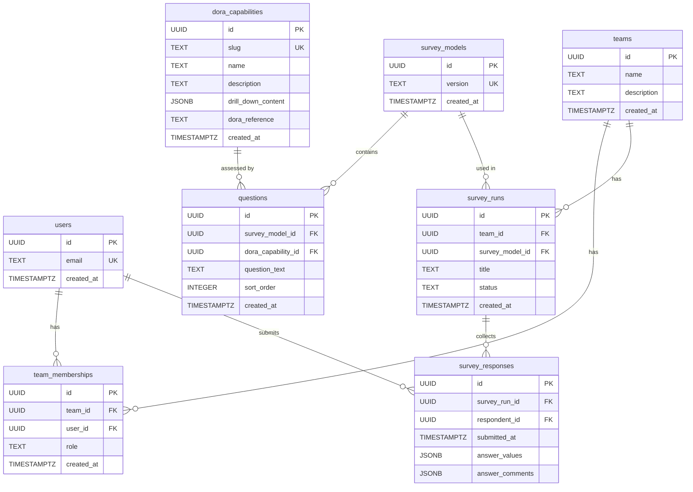

# Database Diagram

```mermaid
erDiagram
    users {
        UUID id PK
        TEXT email UK
        TIMESTAMPTZ created_at
    }

    teams {
        UUID id PK
        TEXT name
        TEXT description
        TIMESTAMPTZ created_at
    }

    team_memberships {
        UUID id PK
        UUID team_id FK
        UUID user_id FK
        TEXT role
        TIMESTAMPTZ created_at
    }

    dora_capabilities {
        UUID id PK
        TEXT slug UK
        TEXT name
        TEXT description
        JSONB drill_down_content
        TEXT dora_reference
        TIMESTAMPTZ created_at
    }

    survey_models {
        UUID id PK
        TEXT version UK
        TIMESTAMPTZ created_at
    }

    questions {
        UUID id PK
        UUID survey_model_id FK
        UUID dora_capability_id FK
        TEXT question_text
        INTEGER sort_order
        TIMESTAMPTZ created_at
    }

    survey_runs {
        UUID id PK
        UUID team_id FK
        UUID survey_model_id FK
        TEXT title
        TEXT status
        TIMESTAMPTZ created_at
    }

    survey_responses {
        UUID id PK
        UUID survey_run_id FK
        UUID respondent_id FK
        TIMESTAMPTZ submitted_at
        JSONB answer_values
        JSONB answer_comments
    }

    users ||--o{ team_memberships : "has"
    teams ||--o{ team_memberships : "has"
    users ||--o{ survey_responses : "submits"
    teams ||--o{ survey_runs : "has"
    survey_models ||--o{ questions : "contains"
    dora_capabilities ||--o{ questions : "assessed by"
    survey_models ||--o{ survey_runs : "used in"
    survey_runs ||--o{ survey_responses : "collects"
```
