# User Story Map

This document provides a User Story Map for MSE Radar, organizing user stories by activities and tasks to support implementation planning.

---

## Overview

The User Story Map is organized around:
- **User Activities** (backbone): High-level goals users want to achieve
- **User Tasks**: Specific actions within each activity
- **User Stories**: Detailed requirements mapped to tasks
- **Release Slices**: Grouped by MoSCoW priority (Must/Should/Could)

### User Personas

| Persona | Description |
|:--------|:------------|
| **New User** | A person who wants to register and access the system |
| **Authenticated User** | A signed-in user who can create teams and participate |
| **Team Member** | A user authorized for a team who can answer surveys and view results |
| **Team Lead** | A team member with permissions to manage team, members, and survey runs |

---

## Story Map Visualization

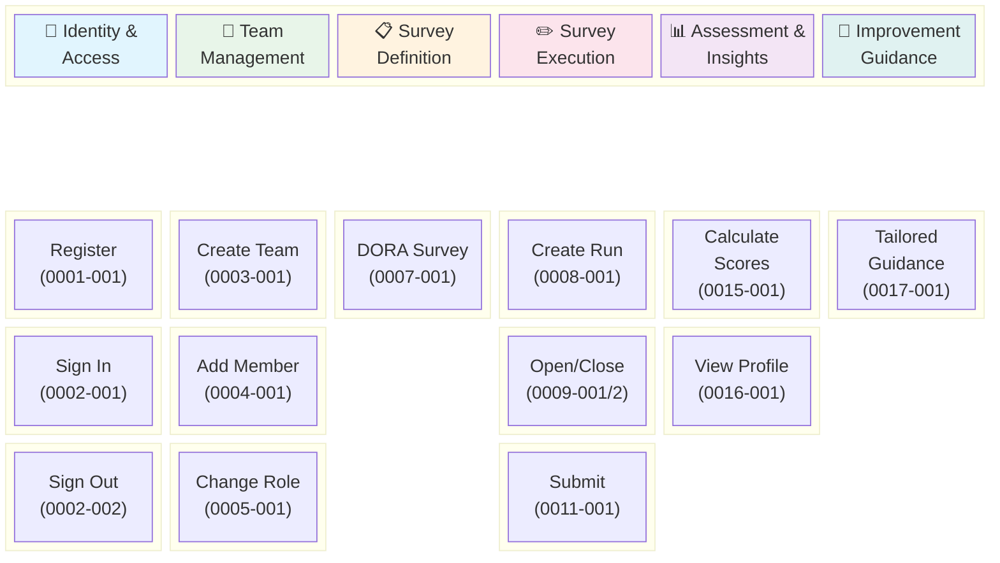

---

## Detailed Story Map by Activity

### Activity 1: Identity & Access (Generic Subdomain)

Manages user identity, authentication, and global access control.

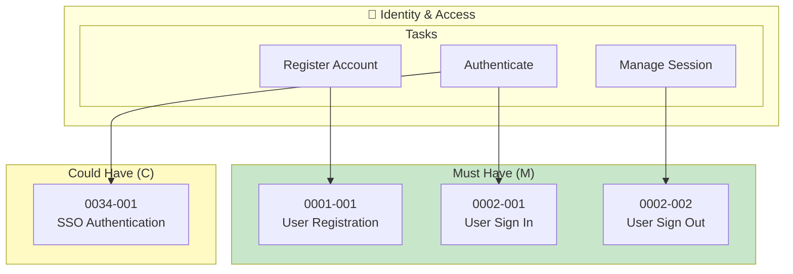

| Story ID | Title | Priority | Estimate | Task |
|:---------|:------|:--------:|:--------:|:-----|
| 0001-001 | User Registration | M | M | Register Account |
| 0002-001 | User Sign In | M | M | Authenticate |
| 0002-002 | User Sign Out | M | S | Manage Session |
| 0034-001 | SSO Authentication | C | L | Authenticate |

---

### Activity 2: Team Management (Supporting Subdomain)

Manages team structure, membership, and role assignments.

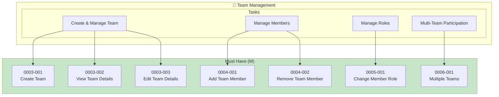

| Story ID | Title | Priority | Estimate | Task |
|:---------|:------|:--------:|:--------:|:-----|
| 0003-001 | Create Team | M | M | Create & Manage Team |
| 0003-002 | View Team Details | M | S | Create & Manage Team |
| 0003-003 | Edit Team Details | M | S | Create & Manage Team |
| 0004-001 | Add Team Member | M | M | Manage Members |
| 0004-002 | Remove Team Member | M | S | Manage Members |
| 0005-001 | Change Member Role | M | M | Manage Roles |
| 0006-001 | Multiple Teams | M | M | Multi-Team Participation |

---

### Activity 3: Survey Definition (Core Subdomain)

Defines the structure and content of surveys based on DORA capabilities.

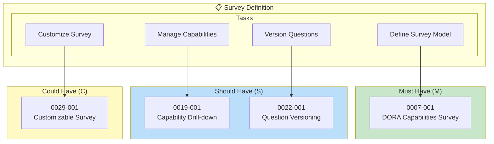

| Story ID | Title | Priority | Estimate | Task |
|:---------|:------|:--------:|:--------:|:-----|
| 0007-001 | DORA Capabilities Survey | M | L | Define Survey Model |
| 0019-001 | Capability Drill-down | S | M | Manage Capabilities |
| 0022-001 | Question Versioning | S | L | Version Questions |
| 0029-001 | Customizable Survey | C | L | Customize Survey |

---

### Activity 4: Survey Execution (Core Subdomain)

Manages the lifecycle of survey runs and collecting responses.

```mermaid
flowchart TB
    subgraph Activity["✏️ Survey Execution"]
        subgraph Tasks["Tasks"]
            T1[Manage Survey Runs]
            T2[Control Lifecycle]
            T3[Submit Responses]
            T4[Enforce Rules]
            T5[Track & Notify]
        end
    end
    
    subgraph Must["Must Have (M)"]
        S0008["0008-001<br/>Create Survey Run"]
        S0009a["0009-001<br/>Open Survey Run"]
        S0009b["0009-002<br/>Close Survey Run"]
        S0009c["0009-003<br/>Reopen Survey Run"]
        S0010["0010-001<br/>Survey Run Isolation"]
        S0011a["0011-001<br/>Submit Response"]
        S0011b["0011-002<br/>Edit Response"]
        S0012["0012-001<br/>Block When Not Open"]
        S0013["0013-001<br/>Block Non-Members"]
        S0014["0014-001<br/>Response Audit Trail"]
    end
    
    subgraph Should["Should Have (S)"]
        S0020["0020-001<br/>Schedule Survey Run"]
        S0021["0021-001<br/>Add Comments"]
        S0023["0023-001<br/>Pseudonymous Responses"]
    end
    
    subgraph Could["Could Have (C)"]
        S0024["0024-001<br/>Participation Tracking"]
        S0028["0028-001<br/>Survey Notifications"]
    end
    
    T1 --> S0008
    T1 --> S0010
    T2 --> S0009a
    T2 --> S0009b
    T2 --> S0009c
    T2 --> S0020
    T3 --> S0011a
    T3 --> S0011b
    T3 --> S0021
    T3 --> S0023
    T4 --> S0012
    T4 --> S0013
    T4 --> S0014
    T5 --> S0024
    T5 --> S0028
    
    style Must fill:#c8e6c9
    style Should fill:#bbdefb
    style Could fill:#fff9c4
```

| Story ID | Title | Priority | Estimate | Task |
|:---------|:------|:--------:|:--------:|:-----|
| 0008-001 | Create Survey Run | M | M | Manage Survey Runs |
| 0009-001 | Open Survey Run | M | S | Control Lifecycle |
| 0009-002 | Close Survey Run | M | S | Control Lifecycle |
| 0009-003 | Reopen Survey Run | M | S | Control Lifecycle |
| 0010-001 | Survey Run Isolation | M | M | Manage Survey Runs |
| 0011-001 | Submit Survey Response | M | M | Submit Responses |
| 0011-002 | Edit Survey Response | M | M | Submit Responses |
| 0012-001 | Block Responses When Not Open | M | S | Enforce Rules |
| 0013-001 | Block Non-Member Responses | M | S | Enforce Rules |
| 0014-001 | Response Audit Trail | M | M | Enforce Rules |
| 0020-001 | Schedule Survey Run | S | M | Control Lifecycle |
| 0021-001 | Add Comments to Answers | S | S | Submit Responses |
| 0023-001 | Pseudonymous Responses | S | L | Submit Responses |
| 0024-001 | Participation Tracking | C | M | Track & Notify |
| 0028-001 | Survey Notifications | C | M | Track & Notify |

---

### Activity 5: Assessment & Insights (Core Subdomain)

Computes scores, aggregates results, and provides visualizations.

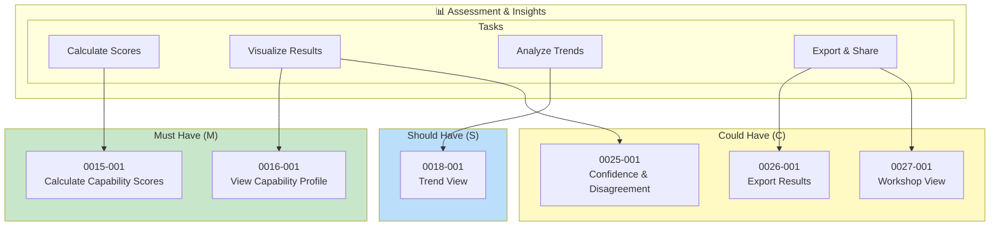

| Story ID | Title | Priority | Estimate | Task |
|:---------|:------|:--------:|:--------:|:-----|
| 0015-001 | Calculate Capability Scores | M | M | Calculate Scores |
| 0016-001 | View Capability Profile | M | M | Visualize Results |
| 0018-001 | Trend View | S | M | Analyze Trends |
| 0025-001 | Confidence and Disagreement | C | M | Visualize Results |
| 0026-001 | Export Results | C | M | Export & Share |
| 0027-001 | Workshop View | C | M | Export & Share |

---

### Activity 6: Improvement Guidance (Core Subdomain)

Provides tailored improvement advice based on assessed capability levels.

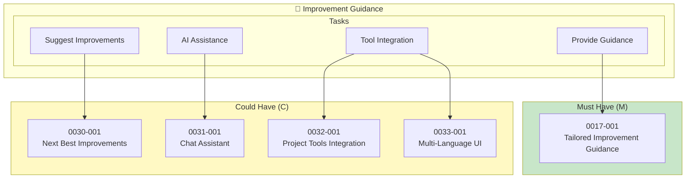

| Story ID | Title | Priority | Estimate | Task |
|:---------|:------|:--------:|:--------:|:-----|
| 0017-001 | Tailored Improvement Guidance | M | L | Provide Guidance |
| 0030-001 | Next Best Improvements | C | M | Suggest Improvements |
| 0031-001 | Chat Assistant | C | L | AI Assistance |
| 0032-001 | Project Tools Integration | C | L | Tool Integration |
| 0033-001 | Multi-Language UI | C | L | Tool Integration |

---

## Release Slices

### Release 1: MVP (Must Have)

Core functionality to enable basic team assessment workflow.

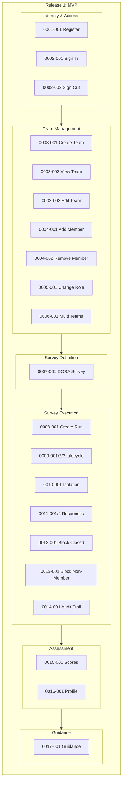

**Total Stories: 21** | **Estimated Effort: M-L**

| # | Story | Context | Estimate |
|:-:|:------|:--------|:--------:|
| 1 | 0001-001 User Registration | Identity & Access | M |
| 2 | 0002-001 User Sign In | Identity & Access | M |
| 3 | 0002-002 User Sign Out | Identity & Access | S |
| 4 | 0003-001 Create Team | Team Management | M |
| 5 | 0003-002 View Team Details | Team Management | S |
| 6 | 0003-003 Edit Team Details | Team Management | S |
| 7 | 0004-001 Add Team Member | Team Management | M |
| 8 | 0004-002 Remove Team Member | Team Management | S |
| 9 | 0005-001 Change Member Role | Team Management | M |
| 10 | 0006-001 Multiple Teams | Team Management | M |
| 11 | 0007-001 DORA Capabilities Survey | Survey Definition | L |
| 12 | 0008-001 Create Survey Run | Survey Execution | M |
| 13 | 0009-001 Open Survey Run | Survey Execution | S |
| 14 | 0009-002 Close Survey Run | Survey Execution | S |
| 15 | 0009-003 Reopen Survey Run | Survey Execution | S |
| 16 | 0010-001 Survey Run Isolation | Survey Execution | M |
| 17 | 0011-001 Submit Survey Response | Survey Execution | M |
| 18 | 0011-002 Edit Survey Response | Survey Execution | M |
| 19 | 0012-001 Block Responses When Not Open | Survey Execution | S |
| 20 | 0013-001 Block Non-Member Responses | Survey Execution | S |
| 21 | 0014-001 Response Audit Trail | Survey Execution | M |
| 22 | 0015-001 Calculate Capability Scores | Assessment & Insights | M |
| 23 | 0016-001 View Capability Profile | Assessment & Insights | M |
| 24 | 0017-001 Tailored Improvement Guidance | Improvement Guidance | L |

---

### Release 2: Enhanced Experience (Should Have)

Features that enhance the user experience and provide deeper insights.

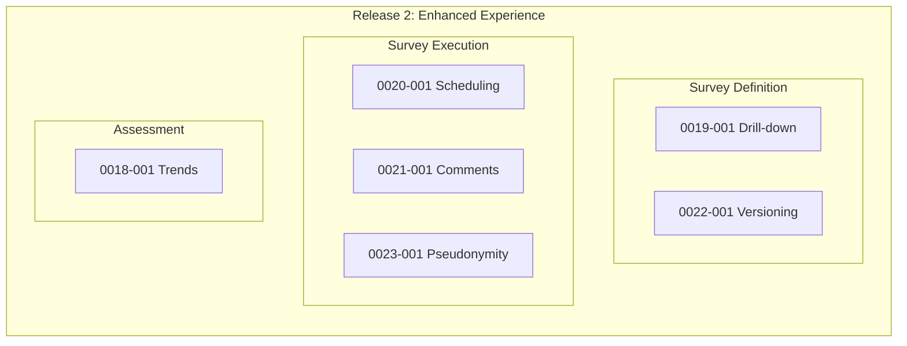

**Total Stories: 6** | **Estimated Effort: M**

| # | Story | Context | Estimate |
|:-:|:------|:--------|:--------:|
| 1 | 0018-001 Trend View | Assessment & Insights | M |
| 2 | 0019-001 Capability Drill-down | Survey Definition | M |
| 3 | 0020-001 Schedule Survey Run | Survey Execution | M |
| 4 | 0021-001 Add Comments to Answers | Survey Execution | S |
| 5 | 0022-001 Question Versioning | Survey Definition | L |
| 6 | 0023-001 Pseudonymous Responses | Survey Execution | L |

---

### Release 3: Advanced Features (Could Have)

Nice-to-have features for advanced use cases and integrations.

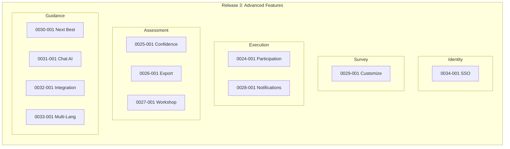

**Total Stories: 11** | **Estimated Effort: L**

| # | Story | Context | Estimate |
|:-:|:------|:--------|:--------:|
| 1 | 0024-001 Participation Tracking | Survey Execution | M |
| 2 | 0025-001 Confidence and Disagreement | Assessment & Insights | M |
| 3 | 0026-001 Export Results | Assessment & Insights | M |
| 4 | 0027-001 Workshop View | Assessment & Insights | M |
| 5 | 0028-001 Survey Notifications | Survey Execution | M |
| 6 | 0029-001 Customizable Survey | Survey Definition | L |
| 7 | 0030-001 Next Best Improvements | Improvement Guidance | M |
| 8 | 0031-001 Chat Assistant | Improvement Guidance | L |
| 9 | 0032-001 Project Tools Integration | Improvement Guidance | L |
| 10 | 0033-001 Multi-Language UI | Improvement Guidance | L |
| 11 | 0034-001 SSO Authentication | Identity & Access | L |

---

## Implementation Dependencies

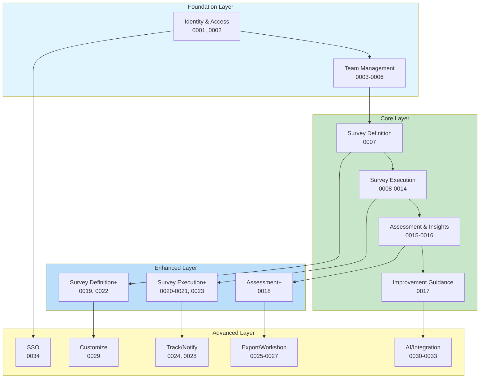

---

## Story Summary by Priority

| Priority | Count | Stories |
|:---------|:-----:|:--------|
| **Must Have (M)** | 24 | 0001-001, 0002-001, 0002-002, 0003-001, 0003-002, 0003-003, 0004-001, 0004-002, 0005-001, 0006-001, 0007-001, 0008-001, 0009-001, 0009-002, 0009-003, 0010-001, 0011-001, 0011-002, 0012-001, 0013-001, 0014-001, 0015-001, 0016-001, 0017-001 |
| **Should Have (S)** | 6 | 0018-001, 0019-001, 0020-001, 0021-001, 0022-001, 0023-001 |
| **Could Have (C)** | 11 | 0024-001, 0025-001, 0026-001, 0027-001, 0028-001, 0029-001, 0030-001, 0031-001, 0032-001, 0033-001, 0034-001 |
| **Total** | **41** | |

---

## Story Summary by Bounded Context

| Context | Type | Must | Should | Could | Total |
|:--------|:-----|:----:|:------:|:-----:|:-----:|
| Identity & Access | Generic | 3 | 0 | 1 | 4 |
| Team Management | Supporting | 7 | 0 | 0 | 7 |
| Survey Definition | Core | 1 | 2 | 1 | 4 |
| Survey Execution | Core | 10 | 3 | 2 | 15 |
| Assessment & Insights | Core | 2 | 1 | 3 | 6 |
| Improvement Guidance | Core | 1 | 0 | 4 | 5 |
| **Total** | | **24** | **6** | **11** | **41** |

---

## Recommended Implementation Order

### Phase 1: Walking Skeleton
Build end-to-end flow with minimal implementation:
1. User Registration & Sign In (0001-001, 0002-001)
2. Create Team (0003-001)
3. DORA Survey Model (0007-001) - hardcoded initially
4. Create & Open Survey Run (0008-001, 0009-001)
5. Submit Response (0011-001)
6. Calculate & View Scores (0015-001, 0016-001)

### Phase 2: Complete MVP
Implement remaining Must-Have stories to complete the MVP:
1. Complete Identity & Access (0002-002)
2. Complete Team Management (0003-002, 0003-003, 0004-001, 0004-002, 0005-001, 0006-001)
3. Complete Survey Execution (0009-002, 0009-003, 0010-001, 0011-002, 0012-001, 0013-001, 0014-001)
4. Add Improvement Guidance (0017-001)

### Phase 3: Enhanced Experience
Implement Should-Have stories:
1. Trend View (0018-001)
2. Capability Drill-down (0019-001)
3. Scheduling & Comments (0020-001, 0021-001)
4. Question Versioning (0022-001)
5. Pseudonymous Responses (0023-001)

### Phase 4: Advanced Features
Implement Could-Have stories based on user feedback and priorities.

---

## References

- [Project Vision](project_vision.md)
- [Requirements](requirements.md)
- [Bounded Contexts](bounded_contexts.md)
- [Architecture Vision](architecture_vision.md)
- [User Stories](stories/)
